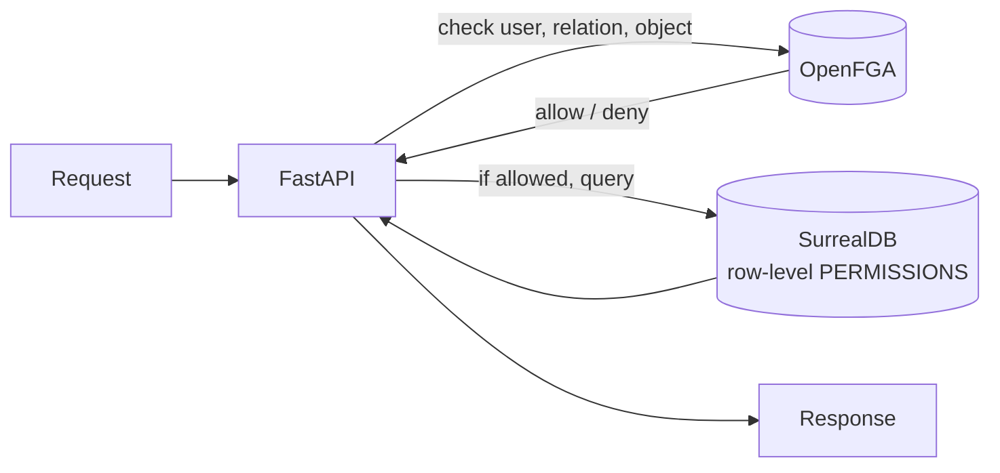

# OpenFGA Authorization Model

An [OpenFGA](https://openfga.dev) (Google Zanzibar–style **ReBAC**) authorization
model for the digital identity & commerce ecosystem.

- Model: [`authz/model.fga`](../authz/model.fga)
- Store test (tuples + assertions): [`authz/store.fga.yaml`](../authz/store.fga.yaml)

## Why alongside SurrealDB, not instead of it

`ARCHITECTURE.md` makes **SurrealDB the source of truth** for data and row-level
`PERMISSIONS`. This model does **not** change that. OpenFGA is added for the
authorization questions that are awkward to express as row rules:

| Concern | Best handled by |
|---------|-----------------|
| Data storage, integrity, audit | SurrealDB |
| Row/field visibility on a single record (`owner = $auth.id`) | SurrealDB `PERMISSIONS` |
| Tenant scoping across many types | OpenFGA (`admin from tenant`) |
| Merchant org membership inheritance | OpenFGA (`organization`) |
| **Referral network / multi-level upline** | OpenFGA (`upline from sponsor`) |

The referral hierarchy is the clearest win: a transitive `upline` relation is a
single line in ReBAC but a recursive graph walk in SQL-style row rules.

## Decision flow



OpenFGA is the **coarse gate** (can this user touch this object at all?);
SurrealDB remains the **last line** (row/field rules on the actual data).

## Types

| Type | Key relations | Maps to |
|------|---------------|---------|
| `tenant` | `admin`, `member` | the `tenant_id` scope used everywhere |
| `organization` | `owner`, `admin`, `member` (inherits `admin from tenant`) | `merchants` |
| `network_node` | `sponsor`, `upline` (transitive) | `referred` graph relation |
| `identity_profile` | `owner`, `can_edit`, `can_view` (`user:*` = public) | `identity_profiles` |
| `membership_program` / `membership_tier` | `can_manage`, `can_view` | `membership_programs` / `membership_tiers` |
| `membership` | `member`, `can_view` | `memberships` |
| `epin` | `holder`, `redeemer`, `can_redeem` | `epins` |
| `referral_commission` | `beneficiary`, `can_view` | `referral_commissions` |
| `payout_batch` | `beneficiary` (`user` or `organization#member`) | generalized `payout_batches` |

The `payout_batch.beneficiary: [user, organization#member]` union mirrors the
polymorphic beneficiary added to `settlements_payouts.surql` (referral payouts go
to a user; settlement payouts to a merchant org's members).

## Example checks (see `store.fga.yaml` for the full set)

- Any user can `can_view` Alice's **public** profile; only the owner or a tenant
  admin can `can_edit` it.
- `network_node:n_alice` is `upline` of `network_node:n_dave` through
  alice → carol → dave — **multi-level**, transitively.
- A downline member (`carol`) cannot `can_view` an upline's commission.
- The merchant org owner (`bob`) can `can_view` a settlement `payout_batch` via
  `organization#member`, while an unrelated user cannot.

## Validate

```bash
# Install the FGA CLI: https://github.com/openfga/cli
fga model test --tests authz/store.fga.yaml
```

> ⚠️ The model is authored to OpenFGA schema 1.1 but has **not** been run through
> the FGA CLI in this environment (CLI unavailable). Validate with the command
> above before relying on it.

## Not included (by design — "Add FGA authz model" scope)

- No OpenFGA server wiring (docker-compose) or Python `check()` middleware.
- No tuple-sync from SurrealDB writes. In a full integration, creating a
  membership / referral / payout would also write the corresponding relationship
  tuple to OpenFGA.
