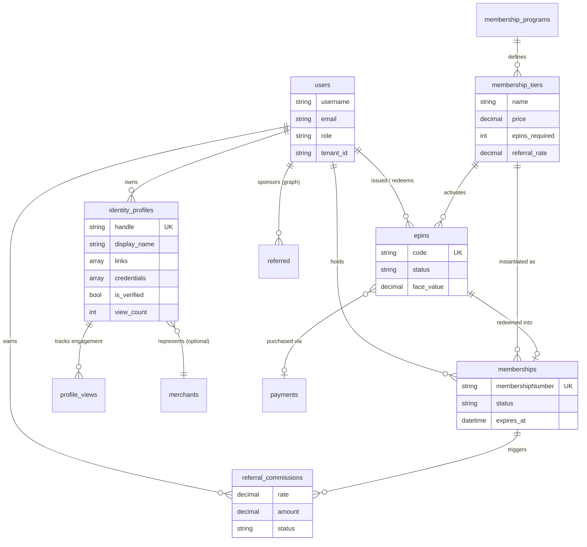
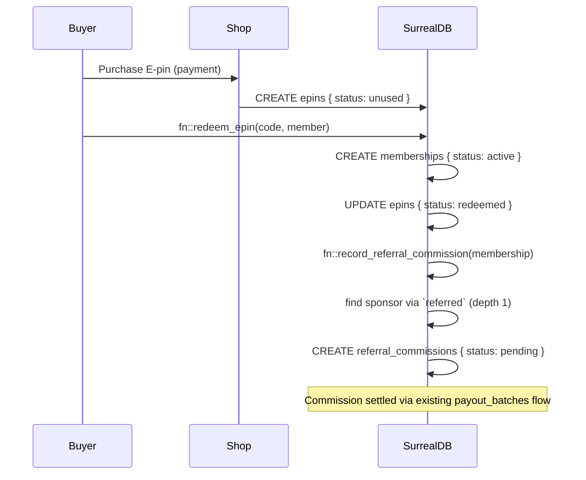

# Digital Commerce Ecosystem

> **Enabling Indian business to go global** — open, digital-native business transformation.

A model for a GoIDC-style *global digital identity & commerce ecosystem*, layered on
top of the existing Agent-Commerce security and commerce schemas. It adds the pieces
that turn a storefront into an identity-driven, referral-powered network: digital
identity profiles ("AI business cards"), membership programs and tiers, prepaid
activation **E-pins**, and a **referral network** with commission accounting.

Schema: [`surrealql/digital_identity_ecosystem.surql`](../surrealql/digital_identity_ecosystem.surql)

## What GoIDC offers (research summary)

`goidc.in` brands itself as a *"Global Digital Identity Ecosystem"* — secure, borderless,
and AI-driven — aimed at connecting professionals, businesses, and investors worldwide.
Direct page fetch returns `403 Forbidden` to automated clients, so the following is
assembled from web search and indexed copies of the site:

| Offering | What it is |
|----------|------------|
| **AI digital business cards** | Shareable digital identity profiles with clickable links, social handles, multimedia, real-time updates, and engagement tracking. |
| **E-pins** | Prepaid, single-use activation codes ("1 E-pin") used to activate a membership. |
| **Membership tiers** | Pricing plans (e.g. *Personal* / *Get Started*) gated by E-pins. |
| **Referral / passive income** | "Passive income – up to ₹2.5cr"; a click-and-earn referral network. |
| **Shop** | `goidc.in/shop/` selling E-pins / plans. |
| **Support** | 24/7 customer support. |

> ⚠️ **Caution flag.** The combination of *prepaid E-pins + membership tiers + large
> "passive income" promises + a referral tree* is characteristic of a **referral / MLM
> (multi-level-marketing) model**. The schema here models the mechanics **neutrally**
> (referral as a legitimate single-level affiliate pattern), but the income claims on the
> live site should be treated with skepticism and verified independently before any
> financial engagement. No independent third-party reviews of GoIDC surfaced during research.

## Domain model



## Entities

| Table | Schema.org grounding | Purpose |
|-------|----------------------|---------|
| `identity_profiles` | [ProfilePage](https://schema.org/ProfilePage) / [Person](https://schema.org/Person) | The digital ID / AI business card: handle, links, credentials, verification. |
| `profile_views` | — | Engagement events (view, link tap, save contact, share). |
| `membership_programs` | [MemberProgram](https://schema.org/MemberProgram) | A membership scheme owned by a tenant. |
| `membership_tiers` | [MemberProgramTier](https://schema.org/MemberProgramTier) | Priced plans, E-pin requirement, and referral rate. |
| `memberships` | [ProgramMembership](https://schema.org/ProgramMembership) | A user's active membership in a tier. |
| `epins` | voucher-style | Prepaid single-use activation codes. |
| `referred` (relation) | — | Graph edge: sponsor → member. |
| `referral_commissions` | [MoneyTransfer](https://schema.org/MoneyTransfer) | Commission credited to a referrer. |

## Lifecycle (activation + referral payout)



## Design notes

- **Reuses existing layers.** Identities come from `security.surql`'s `users`; merchants,
  payments, and the `settlement_ledger_entries` / `payout_batches` machinery in
  `settlements_payouts.surql` handle the actual money movement. `referral_commissions`
  is intentionally shaped like a settlement entry so payouts share one pipeline.
- **Multi-tenant + RLS.** Every table carries `tenant_id` and SurrealDB `PERMISSIONS`
  matching the repo's conventions (owner/admin/tenant scoping).
- **Single-level by default.** `referred.depth` and `referral_commissions.level` leave
  room for multi-level structures, but the shipped function credits only the **direct**
  sponsor — deliberately conservative given the MLM caution above.

## Apply

Add after the commerce and settlement migrations:

```bash
python scripts/apply_surreal_migrations.py
```
